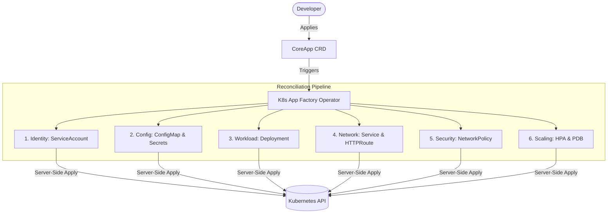

# K8s App Factory 🏭


**K8s App Factory** is an advanced Kubernetes Operator built with Kubebuilder. It abstracts the complexity of deploying stateless applications by providing a declarative `CoreApp` Custom Resource. 

Instead of writing and maintaining hundreds of lines of YAML for Deployments, Services, RBAC, Autoscaling, and Network Policies, developers can simply define their application intent, and the operator will autonomously orchestrate the entire lifecycle with enterprise-grade resilience, security, and observability built-in.

---

## ✨ Enterprise Features

- **🛡️ Secure by Default**: Automatically provisions strict `SecurityContexts` (dropping all capabilities, running as non-root) and zero-trust `NetworkPolicies` locking down egress/ingress unless explicitly needed.
- **📈 Native Autoscaling**: Integrated `HorizontalPodAutoscaler` (HPA) to dynamically scale replicas based on CPU utilization.
- **🔐 Workload Identity**: Provisions dedicated `ServiceAccounts` per application, ready to be linked with AWS IRSA or Azure Workload Identity for secure cloud-native credential management.
- **🔄 High Availability**: Zero-downtime rollouts with `PodDisruptionBudgets` (PDB) and `TopologySpreadConstraints` to ensure pods are distributed evenly across nodes/zones.
- **📊 Deep Observability**: Exposes internal telemetry via `/metrics` (Prometheus) tracking reconciliation durations, success rates, and real-time app readiness.
- **🚦 Traffic Management**: Built-in Gateway API (`HTTPRoute`) integration for modern ingress routing.
- **⚙️ Config Injection**: Seamlessly maps `ConfigMaps` and `Secrets` directly into container environments or volumes.

---

## 🏗 Architecture

The operator acts as an autonomous control loop that continuously watches the desired state (`CoreApp`) and matches it with the actual cluster state. It leverages **Server-Side Apply (SSA)** for conflict-free resource patching.



---

## 🚀 Getting Started

### Prerequisites
- Go v1.24.6+
- Kubernetes cluster v1.25+ (Kind, EKS, GKE, etc.)
- `kubectl` and `helm` installed

### 1. Install the Operator

You can deploy the operator directly to your cluster using `make`:

```bash
# Build and push the controller image to your registry
make docker-build docker-push IMG=your-registry/k8s-app-factory:v1.0.0

# Deploy the CRDs and the Operator
make deploy IMG=your-registry/k8s-app-factory:v1.0.0
```

### 2. Create your first Application

Create a `CoreApp` manifest (`sample-app.yaml`):

```yaml
apiVersion: platform.juandc.dev/v1alpha1
kind: CoreApp
metadata:
  name: my-awesome-api
  namespace: default
spec:
  image: nginxinc/nginx-unprivileged:alpine
  port: 8080
  secureByDefault: true
  autoscaling:
    minReplicas: 2
    maxReplicas: 10
    targetCPUUtilizationPercentage: 75
  pdb:
    minAvailable: 1
  route:
    host: api.mi-portfolio.com
    path: /
```

Apply it to your cluster:

```bash
kubectl apply -f sample-app.yaml
```

**What just happened?** The operator instantly detected the new resource and created:
- A `Deployment` with TopologySpread and restrictive SecurityContexts.
- A `Service` exposed on port 8080.
- A `HorizontalPodAutoscaler` tracking CPU usage to scale up to 10 replicas.
- A `PodDisruptionBudget` ensuring at least 1 pod is always alive during cluster upgrades.
- An `HTTPRoute` for the Gateway API routing traffic to `api.mi-portfolio.com`.
- A dedicated `ServiceAccount`.

---

## 📖 API Reference (`CoreAppSpec`)

| Field | Type | Default | Description |
|---|---|---|---|
| `image` | string | **Required** | Container image to run (e.g., `nginx:latest`). |
| `port` | int32 | **Required** | The port the application binds to. |
| `autoscaling` | object | **Required** | HPA config (`minReplicas`, `maxReplicas`, `targetCPU`). |
| `secureByDefault` | bool | `true` | Injects zero-trust SecurityContexts and drops kernel capabilities. |
| `probes` | object | `nil` | Native K8s liveness/readiness probes configuration. |
| `env` / `envFrom` | []object | `nil` | Environment variables, ConfigMap and Secret references. |
| `volumes` | object | `nil` | Mount paths for static configurations or secret files. |
| `serviceAccountName` | string | `[App Name]-sa`| Identity to bind to the Pods for IAM integration. |
| `pdb` | object | `nil` | Pod Disruption Budget config (`minAvailable`, `maxUnavailable`). |
| `route` | object | `nil` | Exposes the app externally via Gateway API (`host`, `path`). |

---

## 📊 Observability

The operator exports rich Prometheus metrics via a secure HTTPS endpoint (`:8443`). You can grant `metrics-reader` RBAC roles to your Prometheus instance to scrape it.

**Key Custom Metrics:**
- `coreapp_ready` (Gauge): 1 if the underlying deployment is fully rolled out and healthy, 0 otherwise.
- `coreapp_reconcile_total` (Counter): Total number of reconciliation loops grouped by success/error.
- `coreapp_reconcile_duration_seconds` (Histogram): Performance tracking of the operator's internal pipeline.

---

## 🛠 CI/CD & Releases

This repository includes a robust GitHub Actions pipeline (`release.yml`). 
Whenever a new semantic tag (e.g., `v1.2.0`) is pushed, the pipeline uses **AWS OIDC** to securely authenticate with AWS, builds a multi-architecture Docker image (`linux/amd64` and `linux/arm64`), and pushes it to **Amazon ECR**.

---

## 👨‍💻 Development

### Running locally
You can run the operator locally against your active kubeconfig for fast iteration:

```bash
# Install CRDs
make install

# Run controller in foreground
ENABLE_WEBHOOKS=false make run
```

### Running Tests
This project relies on `envtest` for isolated, fast, and reliable integration testing against a real Kubernetes API server.

```bash
make test
```

*Coverage currently sits at **~80%** across all controllers and reconciliation steps.*

---

## 📜 License

Copyright 2026.

Licensed under the Apache License, Version 2.0 (the "License");
you may not use this file except in compliance with the License.
You may obtain a copy of the License at

    http://www.apache.org/licenses/LICENSE-2.0

Unless required by applicable law or agreed to in writing, software
distributed under the License is distributed on an "AS IS" BASIS,
WITHOUT WARRANTIES OR CONDITIONS OF ANY KIND, either express or implied.
See the License for the specific language governing permissions and
limitations under the License.
